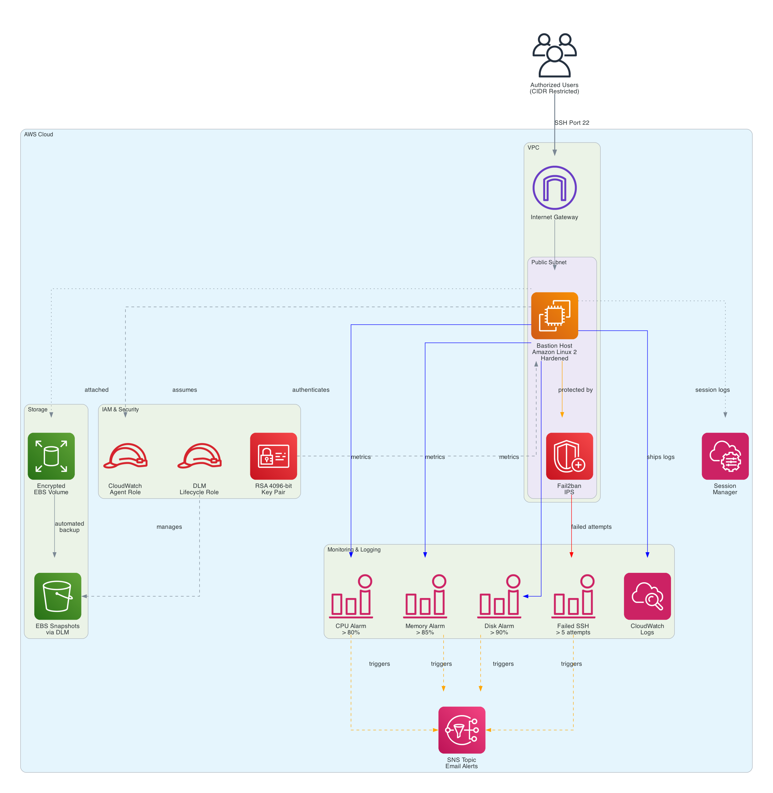

# Terraform Secure Bastion

A production-ready Terraform module for deploying hardened EC2 bastion hosts with comprehensive security controls, monitoring, and automated backup capabilities.

## Overview

This module provisions a secure bastion host infrastructure with automated security hardening, comprehensive audit logging, and disaster recovery capabilities. Built for production environments requiring controlled SSH access to private resources with enterprise-grade security and compliance.

## Features

### Security & Compliance
- **SSH Hardening**: Key-only authentication with RSA 4096-bit keys
- **Intrusion Prevention**: Fail2ban automatically blocks malicious actors
- **Network Isolation**: Restrictive security groups with CIDR validation
- **Data Protection**: Encrypted EBS volumes with KMS
- **Instance Hardening**: IMDSv2 enforcement and security updates
- **Audit Trail**: Comprehensive CloudWatch logging for compliance
- **Zero Trust**: Input validation preventing 0.0.0.0/0 exposure

### Monitoring & Alerting
- **Real-time Metrics**: CPU, memory, and disk utilization tracking
- **Security Events**: Failed SSH attempt detection and alerting
- **CloudWatch Integration**: Centralized logging and metrics
- **SNS Notifications**: Email alerts for critical events
- **Custom Metrics**: Application-specific monitoring capabilities
- **Log Analysis**: Metric filters for security event detection

### Automation & Recovery
- **Infrastructure as Code**: Fully automated deployment
- **Backup Strategy**: Automated EBS snapshots via Data Lifecycle Manager
- **Self-Healing**: User data scripts for consistent configuration
- **Pre-commit Validation**: Automated security and compliance checks
- **State Management**: Encrypted S3 backend with locking

## Architecture



### Module Structure

The repository consists of three specialized Terraform modules working in concert:

#### 1. EC2 Secure Module (`modules/ec2-secure/`)
- Hardened EC2 bastion instance with Amazon Linux 2023
- Security group with restrictive SSH access (validated CIDR blocks)
- IAM roles and instance profiles for CloudWatch and DLM
- Encrypted EBS volumes with automated snapshot lifecycle
- User data script for security hardening and monitoring setup

#### 2. CloudWatch Module (`modules/cloudwatch/`)
- Log groups for SSH authentication and failed attempts
- CloudWatch alarms for system metrics (CPU, memory, disk)
- Security event monitoring with custom metric filters
- SNS topic integration for email notifications
- Failed SSH attempt tracking and alerting

#### 3. Key Pair Module (`modules/key-pair/`)
- RSA 4096-bit SSH key pair generation
- Secure key storage and management
- Public key output for distribution

## Prerequisites

- Terraform >= 1.5
- AWS CLI configured with appropriate credentials
- Existing VPC with public subnet
- S3 bucket for Terraform state backend
- Valid email address for CloudWatch alarm notifications

## Quick Start

### 1. Clone the Repository
```bash
git clone https://github.com/yourusername/terraform-secure-bastion.git
cd terraform-secure-bastion
```

### 2. Configure Variables
```bash
cp terraform.tfvars.example terraform.tfvars
# Edit terraform.tfvars with your values
```

### 3. Initialize Terraform
```bash
terraform init \
  -backend-config="bucket=YOUR_STATE_BUCKET" \
  -backend-config="key=bastion/terraform.tfstate" \
  -backend-config="region=us-east-1"
```

### 4. Deploy Infrastructure
```bash
terraform plan -var-file="terraform.tfvars"
terraform apply -var-file="terraform.tfvars"
```

## Module Usage

The root module orchestrates three child modules:

```hcl
# main.tf example
module "keypair" {
  source      = "./modules/key-pair"
  name_prefix = var.project_name
  tags        = local.common_tags
}

module "bastion" {
  source = "./modules/ec2-secure"
  
  name_prefix         = var.project_name
  subnet_id           = data.aws_subnets.public.ids[0]
  allowed_cidr_blocks = var.allowed_cidr_blocks
  key_name            = module.keypair.key_name
  instance_type       = var.instance_type
  dlm_retain_policy   = var.dlm_retain_policy
  tags                = local.common_tags
}

module "cloudwatch_bastion" {
  source = "./modules/cloudwatch"
  
  instance_id                = module.bastion.instance_id
  instance_name              = "${var.project_name}-bastion"
  cpu_threshold_percent      = var.cpu_threshold_percent
  memory_threshold_percent   = var.memory_threshold_percent
  disk_threshold_percent     = var.disk_threshold_percent
  failed_ssh_threshold       = var.failed_ssh_threshold
  email_subscriber           = var.bastion_email_subscriber_one
  tags                       = local.common_tags
}
```

## Configuration

### Required Variables

| Variable | Description | Type | Validation |
|----------|-------------|------|------------|
| `project_name` | Project identifier used in resource naming | `string` | Required |
| `allowed_cidr_blocks` | List of CIDR blocks for SSH access | `list(string)` | Cannot be 0.0.0.0/0 |
| `bastion_email_subscriber_one` | Email for CloudWatch alarm notifications | `string` | Valid email format |

### Optional Variables

| Variable | Description | Default | Type |
|----------|-------------|---------|------|
| `aws_region` | AWS deployment region | `us-east-1` | `string` |
| `instance_type` | EC2 instance type | `t3.micro` | `string` |
| `dlm_retain_policy` | Days to retain EBS snapshots | `14` | `number` |
| `cpu_threshold_percent` | CPU utilization alarm threshold | `80` | `number` |
| `memory_threshold_percent` | Memory usage alarm threshold | `85` | `number` |
| `disk_threshold_percent` | Disk usage alarm threshold | `90` | `number` |
| `failed_ssh_threshold` | Failed SSH attempts before alarm | `5` | `number` |
| `log_group_prefix` | CloudWatch log group prefix | `/aws/ec2/bastion` | `string` |
| `ssh_log_group_name` | SSH authentication log group | `ssh-auth` | `string` |
| `failed_ssh_log_group_name` | Failed SSH log group | `failed-ssh` | `string` |

## Security Best Practices

### Network Security
- **CIDR Validation**: Prevents 0.0.0.0/0 exposure through Terraform validation
- **Egress Control**: Outbound traffic limited to essential services
- **Security Groups**: Least-privilege principle enforced

### Access Control
- **SSH Hardening**: Key-only authentication with RSA 4096-bit keys
- **Fail2ban**: Automatic IP blocking after failed attempts
- **No Root Access**: Direct root login disabled
- **Session Logging**: All SSH sessions logged to CloudWatch

### Data Protection
- **Encryption at Rest**: EBS volumes encrypted with AWS KMS
- **Automated Backups**: Daily snapshots with configurable retention
- **Secure State**: Terraform state encrypted in S3 with versioning

### Monitoring & Compliance
- **Audit Trail**: Complete logging of authentication attempts
- **Real-time Alerts**: Immediate notification of security events
- **Metric Tracking**: Custom metrics for security analysis
- **Compliance Ready**: Supports SOC2, PCI-DSS, and HIPAA requirements

## Outputs

| Output | Description | Example |
|--------|-------------|----------|
| `bastion_public_ip` | Public IP address of the bastion host | `54.123.45.67` |
| `bastion_instance_id` | EC2 instance ID | `i-0abc123def456789` |
| `ssh_connection_command` | Pre-formatted SSH connection string | `ssh -i key.pem ec2-user@54.123.45.67` |

## Development

### Pre-commit Hooks

This repository uses pre-commit hooks for validation:

```bash
# Install pre-commit
pip install pre-commit

# Install hooks
pre-commit install

# Run all checks
pre-commit run --all-files
```

Validation includes:
- **Terraform Format**: Ensures consistent code formatting
- **Terraform Validate**: Checks configuration validity
- **TFSec**: Security and compliance scanning
- **Documentation**: Auto-generates module documentation

### Testing Commands

```bash
# Format check
terraform fmt -check -recursive

# Validate configuration
terraform validate

# Security scan
tfsec . --severity HIGH,CRITICAL

# Plan with specific variables
terraform plan -var-file="terraform.tfvars"
```

## License

MIT License - see [LICENSE](LICENSE) file for details