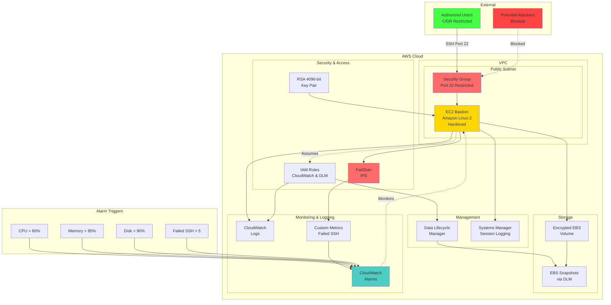

# Terraform EC2 Secure SSH Bastion

A production-ready Terraform module for deploying hardened EC2 bastion hosts with comprehensive security controls and monitoring.

## Overview

This module provisions a secure bastion host infrastructure with automated security hardening, audit logging, and backup capabilities. Designed for production environments requiring controlled SSH access to private infrastructure.

## Features

### Security
- SSH hardening with key-only authentication
- Fail2ban intrusion prevention system
- Network isolation with restrictive security groups
- Encrypted EBS volumes
- IMDSv2 enforcement
- Comprehensive audit logging via AWS CloudWatch
- Input validation preventing 0.0.0.0/0 exposure

### Operations
- Automated EBS snapshot lifecycle management
- CloudWatch metrics and log aggregation
- Real-time monitoring with configurable alarms:
  - CPU utilization tracking
  - Memory usage monitoring
  - Disk space alerts
  - Failed SSH attempt detection
- User data automation for consistent deployments
- Infrastructure as Code with pre-commit validation

## Architecture



The module creates:
- EC2 instance with hardened Amazon Linux 2
- Security group with controlled ingress/egress
- IAM roles for CloudWatch and DLM operations
- RSA 4096-bit SSH key pair
- Data Lifecycle Manager policy for automated backups
- CloudWatch alarms for system and security monitoring

## Prerequisites

- Terraform >= 1.5
- AWS CLI configured with appropriate credentials
- VPC with public subnet

## Usage

```hcl
module "bastion" {
  source = "./modules/ec2-secure"

  name_prefix         = "production"
  subnet_id           = "subnet-12345678"
  allowed_cidr_blocks = ["203.0.113.0/32"]
  key_name            = module.keypair.key_name
  
  tags = {
    Environment = "production"
    ManagedBy   = "terraform"
  }
}

module "monitoring" {
  source = "./modules/cloudwatch"

  instance_id               = module.bastion.instance_id
  instance_name            = "production-bastion"
  cpu_threshold_percent    = 80
  memory_threshold_percent = 85
  disk_threshold_percent   = 90
  failed_ssh_threshold     = 5
  
  tags = {
    Environment = "production"
    ManagedBy   = "terraform"
  }
}
```

## Configuration

### Required Variables

| Variable | Description | Type |
|----------|-------------|------|
| `project_name` | Project identifier | `string` |
| `allowed_cidr_blocks` | List of CIDR blocks allowed SSH access | `list(string)` |
| `backend_bucket_name` | S3 bucket for Terraform state | `string` |
| `backend_bucket_key` | S3 key path for state file | `string` |

### Optional Variables

| Variable | Description | Default |
|----------|-------------|---------|
| `environment` | Environment name | `dev` |
| `aws_region` | AWS region | `us-east-1` |
| `instance_type` | EC2 instance type | `t3.micro` |
| `dlm_retain_policy` | Days to retain EBS snapshots | `14` |
| `cpu_threshold_percent` | CPU alarm threshold | `80` |
| `memory_threshold_percent` | Memory alarm threshold | `85` |
| `disk_threshold_percent` | Disk usage alarm threshold | `90` |
| `failed_ssh_threshold` | Failed SSH attempts before alarm | `5` |

## Security Considerations

- SSH access restricted to specified CIDR blocks only
- All traffic logged to CloudWatch for audit purposes
- Failed SSH attempts tracked with automatic alerting
- Automatic security updates via user data script
- Regular snapshots for disaster recovery
- No password authentication permitted

## Outputs

| Output | Description |
|--------|-------------|
| `bastion_public_ip` | Public IP address of the bastion host |
| `bastion_instance_id` | EC2 instance ID |
| `ssh_connection_command` | Pre-formatted SSH connection string |
| `cloudwatch_alarm_arns` | ARNs of created CloudWatch alarms |

## Testing

Pre-commit hooks validate:
- Terraform formatting
- Configuration validity
- Security compliance via tfsec

```bash
pre-commit install
pre-commit run --all-files
```